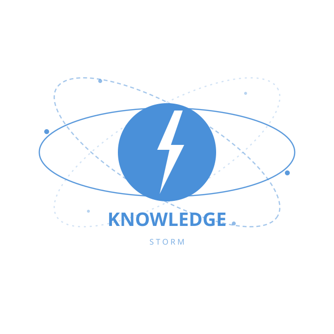
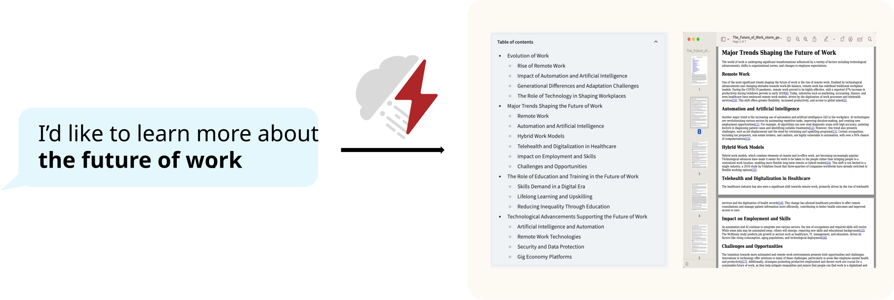
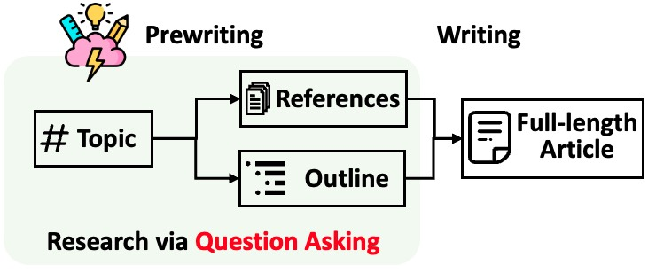
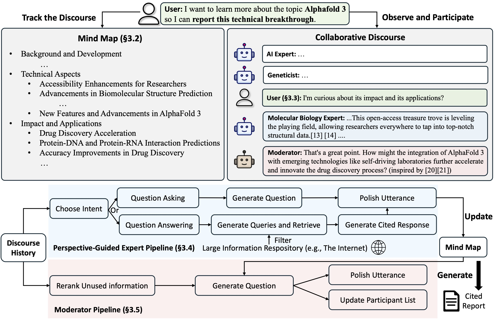

<p align="center">
  
</p>

<h1 align="center">Knowledge STORM</h1>
<p align="center">
  <em>An LLM-powered knowledge curation system for automated research and structured article generation</em>
</p>

<p align="center">
  
  
  
  
  
  
</p>

---

## Overview

**Knowledge STORM** is a modular, LLM-powered pipeline that autonomously researches any topic using live web search and produces a comprehensive, Wikipedia-style article complete with citations — all with zero manual effort.

This project is a refactored and extended version of the original [STORM](https://github.com/stanford-oval/storm) system, re-engineered for accessibility and modern LLM backends. Key improvements include native **Google Gemini** integration and **DuckDuckGo** search support, making the entire pipeline fully functional without any paid API subscriptions.

<p align="center">
  
</p>

---

## Key Features

- **Automated Research** — Conducts multi-perspective internet research and synthesizes findings into a structured outline
- **Article Generation** — Produces long-form, citation-backed articles from collected knowledge
- **Co-STORM Collaboration** — Enables real-time human-AI collaborative research with a dynamic mind map
- **Free API Support** — Runs entirely on Google Gemini (free tier) and DuckDuckGo (no key required)
- **Modular Architecture** — Plug-and-play support for any LLM or search engine via LiteLLM

---

## Tech Stack

| Layer | Technology |
|---|---|
| Language | Python 3.11 |
| LLM Framework | [DSPy](https://github.com/stanfordnlp/dspy) · [LiteLLM](https://github.com/BerriAI/litellm) |
| Default LLM | Google Gemini 1.5 Flash (free tier) |
| Default Search | DuckDuckGo (no key required) |
| Vector Store | Qdrant · sentence-transformers |
| Frontend (optional) | Streamlit |
| Packaging | setuptools · pip |

---

## Sample Output

Want to see what STORM produces before running it yourself?
A full sample article on **Quantum Computing** is available in [`samples/quantum_computing.md`](samples/quantum_computing.md).

---

## How It Works

### STORM — Automated Pipeline

STORM breaks article generation into two clean stages:

**Stage 1 — Pre-Writing (Research)**
The system searches the web, collects references, and builds a hierarchical outline using two core strategies:
- **Perspective-Guided Question Asking** — Discovers multiple viewpoints by surveying related topics
- **Simulated Conversation** — Mimics a dialogue between a writer and a domain expert to surface deeper insights

**Stage 2 — Writing**
The outline and collected references are used to generate a full-length article with inline citations.

<p align="center">
  
</p>

---

### Co-STORM — Collaborative Mode

Co-STORM extends the pipeline with a **collaborative discourse protocol**, bringing together:

- **LLM Experts** — AI agents that answer questions grounded in retrieved sources
- **Moderator** — An agent that surfaces unexplored angles and steers the conversation
- **Human User** — You can observe passively or actively steer the research at any point

<p align="center">
  
</p>

Co-STORM maintains a live **mind map** that organizes all collected information into a hierarchical concept structure — reducing cognitive load during deep, long-form research sessions.

---

## Installation

**Install via pip:**
```bash
pip install knowledge-storm
```

**Or install from source (recommended for customization):**
```bash
git clone https://github.com/TheMEGALODON55681/knowledge-storm-refactored.git
cd knowledge-storm-refactored
conda create -n storm python=3.11
conda activate storm
pip install -r requirements.txt
```

---

## Configuration

Copy the included template and fill in your API key:

```bash
cp secrets.toml.example secrets.toml
```

Then edit `secrets.toml`:

```toml
# Language Model
GOOGLE_API_KEY="your_gemini_api_key"   # Free at aistudio.google.com

# No search engine key needed — DuckDuckGo is used by default
```

> **Get your free Gemini API key** at [aistudio.google.com](https://aistudio.google.com) — no credit card required.

> ⚠️  `secrets.toml` is listed in `.gitignore`. Never commit your API keys.

---

## Quick Start

### Run STORM (Fully Automated)
```bash
python examples/storm_examples/run_storm_wiki_gemini.py \
    --output-dir results/storm \
    --retriever duckduckgo \
    --do-research \
    --do-generate-outline \
    --do-generate-article \
    --do-polish-article
```

### Run Co-STORM (Human + AI Collaborative)
```bash
python examples/costorm_examples/run_costorm_gemini.py \
    --output-dir results/co-storm \
    --enable_log_print
```

You will be prompted to enter a topic. The system will warm-start, begin its research, and invite you to steer the conversation. A final `report.md` will be saved in your output directory.

---

## Supported Integrations

**Language Models** — Any model supported by [LiteLLM](https://docs.litellm.ai/docs/providers), including:
`Gemini` · `GPT-4o` · `Claude` · `Mistral` · `LLaMA` · and more

**Search / Retrieval** — `DuckDuckGo` · `Bing` · `You.com` · `Brave` · `Serper` · `Tavily` · `SearXNG` · `VectorRM (local docs)`

---

## Project Structure

```
knowledge-storm-refactored/
│
├── knowledge_storm/
│   ├── storm_wiki/          # Core STORM automated pipeline
│   ├── collaborative_storm/ # Co-STORM human-AI collaboration engine
│   ├── lm.py                # Language model interfaces
│   ├── rm.py                # Retrieval module integrations
│   └── interface.py         # Abstract base interfaces
│
├── examples/
│   ├── storm_examples/      # Scripts to run STORM
│   └── costorm_examples/    # Scripts to run Co-STORM (Gemini version included)
│
├── samples/                 # Example generated articles
├── frontend/                # Streamlit demo UI
├── assets/                  # Images and diagrams
├── requirements.txt
├── secrets.toml.example     # Template — copy to secrets.toml and add your key
└── secrets.toml             # Your API keys (not committed to git)
```

---

## Customization

### Swap the Language Model
Edit the model name in your run script:
```python
from knowledge_storm.lm import LitellmModel
model = LitellmModel(model="gemini/gemini-1.5-flash", max_tokens=1000, api_key="YOUR_KEY")
```

### Swap the Search Engine
```python
from knowledge_storm.rm import DuckDuckGoSearchRM, BingSearch
rm = DuckDuckGoSearchRM(k=10)  # No API key needed
```

### Customize Pipeline Modules
Each stage of the pipeline (knowledge curation, outline generation, article generation, polishing) is independently defined in `knowledge_storm/interface.py` and implemented in `knowledge_storm/storm_wiki/modules/`. Any module can be subclassed and replaced.

---

## Output

After a run, results are saved to your `--output-dir`:

| File | Description |
|---|---|
| `report.md` | Final generated article with citations |
| `instance_dump.json` | Full pipeline state snapshot |
| `log.json` | Conversation and research log |

---

## Roadmap

Planned improvements and features under consideration:

- [ ] **Ollama integration** — Run the full pipeline against local LLMs (Llama, Mistral, Phi) for offline use
- [ ] **Result caching** — Cache retrieval results to avoid redundant searches when iterating on the same topic
- [ ] **PDF / DOCX export** — One-click export of the generated article in standard document formats
- [ ] **Improved web UI** — A richer interface beyond the existing Streamlit demo
- [ ] **Multi-language article generation** — Generate articles in languages other than English
- [ ] **Citation deduplication** — Smarter merging of overlapping sources during polishing
- [ ] **Cost estimator** — Pre-run estimate of LLM token usage and cost

Contributions and feature requests are welcome — see [CONTRIBUTING.md](CONTRIBUTING.md).

---

## Acknowledgements

This project builds upon the original [STORM](https://github.com/stanford-oval/storm) research system developed at Stanford University. The foundational research is published in:

- [STORM Paper — NAACL 2024](https://arxiv.org/abs/2402.14207)
- [Co-STORM Paper — EMNLP 2024](https://www.arxiv.org/abs/2408.15232)

---

## License

This project is licensed under the MIT License. See [LICENSE](LICENSE) for details.
